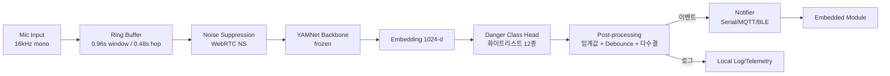

# 캡스톤 디자인 개발 계획서: YAMNet 기반 위험 소리 감지 시스템

> 본 문서는 YAMNet을 활용해 실제 환경 소리에서 위험 소리를 감지하고, 임베디드 모듈로 알림을 전달하는 시스템의 전체 개발 계획을 정의한다.
> 상위 결정 사항은 `CLAUDE.md`를 따르며, 본 문서는 이를 구체화한다.

---

## 1. 프로젝트 목표 및 성공 기준

### 1.1 목표
- **주요 목표**: 다중 소리가 혼재한 실환경에서 위험 소리(비명, 유리 깨짐, 화재 경보, 사이렌, 총소리, 폭발음 등)를 실시간으로 감지하고, 임베디드 모듈(MCU/SBC)로 알림을 전달.
- **부차 목표**: 노이즈 캔슬링을 통한 false positive 최소화, on-device 동작 가능한 경량 모델 확보.

### 1.2 정량적 성공 기준 (KPI)

| 지표 | 목표 값 | 측정 방법 |
|---|---|---|
| 위험 클래스 평균 F1 | ≥ 0.80 | 자체 평가셋 기준 클래스별 F1 macro 평균 |
| 위험 클래스 Recall | ≥ 0.85 | 놓치면 안 되는 알림 특성상 재현율 우선 |
| False Alarm Rate (FAR) | ≤ 1회/시간 | 정상 환경 음원 1시간 재생 시 오탐 횟수 |
| End-to-end Latency | ≤ 1.0s | 마이크 입력 → 임베디드 알림 수신까지 |
| 모델 크기 | ≤ 5MB (TFLite) | YAMNet backbone + 헤드 합산 |
| 메모리 (RAM 피크) | ≤ 50MB | 임베디드 SBC 기준(라즈베리파이 4 가정) |
| CPU 사용률 | ≤ 50% | Cortex-A72 1코어 기준 |

### 1.3 비기능 요구
- 실시간성: 0.96초 윈도우(YAMNet 표준) + 0.48초 hop 기준 끊김 없이 처리.
- 견고성: 60dB 이상 환경 소음 속에서도 동작.
- 확장성: 클래스 화이트리스트는 설정 파일로 변경 가능해야 함.

---

## 2. 위험 소리 클래스 후보 선정

### 2.1 환경 시나리오
- **가정**: 화재, 가스 누출, 침입, 영유아 위급 상황.
- **거리/실외**: 차량 사고, 폭력 상황, 사이렌, 총격.
- **공공 시설**: 비명, 패닉, 경보 장치.

### 2.2 후보 클래스 (AudioSet 521 기반)

| YAMNet 인덱스 (대략) | 클래스명 | 환경 | 우선순위 | 선정 근거 |
|---|---|---|---|---|
| 0 | Speech | 공통 | 제외 | 일상음, 위험 무관 |
| 47 | Screaming | 가정/공공 | **필수** | 직접적 위급 신호 |
| 49 | Crying, sobbing | 가정 | 권장 | 영유아/피해자 신호 |
| 67 | Baby cry, infant cry | 가정 | **필수** | 영유아 위급 |
| 316 | Glass, Shatter | 가정/공공 | **필수** | 침입/사고 강한 단서 |
| 388 | Gunshot, gunfire | 실외/공공 | **필수** | 치명적 위험 |
| 390 | Explosion | 실외 | **필수** | 치명적 위험 |
| 396 | Fire alarm | 가정/공공 | **필수** | 화재 직접 신호 |
| 397 | Smoke detector, smoke alarm | 가정 | **필수** | 화재 직접 신호 |
| 316~ | Civil defense siren | 실외 | **필수** | 공공 경보 |
| 391 | Siren | 실외 | **필수** | 응급/경찰 신호 |
| 392 | Police car (siren) | 실외 | 권장 | Siren 세분류 |
| 393 | Ambulance (siren) | 실외 | 권장 | Siren 세분류 |
| 394 | Fire engine, fire truck (siren) | 실외 | 권장 | Siren 세분류 |
| 395 | Car alarm | 실외 | 권장 | 도난/사고 |
| 318 | Breaking | 가정/공공 | 권장 | 파손음 |
| 389 | Machine gun | 실외 | 보류 | 사용 환경 한정 |
| 432 | Vehicle horn, car horn, honking | 실외 | 권장 | 사고 직전 신호 |

### 2.3 1차 화이트리스트(추천)
> Screaming, Baby cry, Glass shatter, Gunshot, Explosion, Fire alarm, Smoke alarm, Siren(상위), Civil defense siren, Car alarm, Vehicle horn, Breaking — 총 12종.

- **선정 이유**: AudioSet에서 비교적 학습 샘플이 충분하고, 각 환경 시나리오를 커버하며, YAMNet 사전학습 성능 자체가 양호한 클래스들 위주.
- **트레이드오프**: 사이렌 세분류(경찰/구급/소방)는 일반 Siren으로 통합해 confusion을 줄임. 추후 임베디드에서 메타데이터 필요 시 분리.

### 2.4 환경별 프로파일
| 프로파일 | 활성화 클래스 |
|---|---|
| Home | Screaming, Baby cry, Glass shatter, Fire alarm, Smoke alarm, Breaking |
| Street | Gunshot, Explosion, Siren, Car alarm, Vehicle horn, Screaming |
| Public | 위 모두 합집합 |

---

## 3. 데이터셋 전략

### 3.1 후보 비교

| 데이터셋 | 규모 | 라벨 품질 | 위험클래스 커버 | 라이선스 | 장점 | 단점 |
|---|---|---|---|---|---|---|
| AudioSet | 200만+ 클립, 521 클래스 | weak label | 매우 높음 | CC-BY (메타만) | YAMNet과 동일 분류체계 | 원본 오디오 직접 배포 X (YouTube 의존) |
| ESC-50 | 2,000 클립 / 50 클래스 | strong | 중간 (유리, 사이렌, 비명 등 일부) | CC | 깔끔한 평가셋 | 규모 작음 |
| UrbanSound8K | 8,732 클립 / 10 클래스 | strong | 도시환경 한정 (siren, gun shot 포함) | CC-BY-NC | 도시 시나리오 적합 | 가정환경 부족 |
| FSD50K | 51,000+ 클립 / 200 클래스 | strong | 높음 (AudioSet ontology 호환) | CC | AudioSet 호환, 직접 배포 | 도메인 편향 일부 |
| FSD-Kaggle 2018/2019 | 추가 | strong | 부분 | CC | 보강용 | 중복 가능 |

### 3.2 추천 전략
1. **학습 임베딩 추출용**: YAMNet 사전학습 그대로 사용(별도 학습 X).
2. **헤드 파인튜닝/임계값 튜닝용**: **FSD50K + UrbanSound8K + ESC-50 조합** 추천.
   - 이유: 직접 다운로드 가능, AudioSet ontology와 매핑 용이, 도시+가정 시나리오 모두 커버.
3. **평가셋(별도 구성)**:
   - **Held-out FSD50K eval split** (재현성)
   - **자체 수집 현장 녹음** (각 위험 클래스당 최소 30 샘플) — 도메인 갭 측정
   - **Negative set**: 일상 환경음 1시간 무편집 녹음(가정 거실, 거리, 카페 등 3종) — FAR 측정용

### 3.3 데이터 증강
- 배경 소음 mix-in (DEMAND, MUSAN noise) → SNR -5~20dB 랜덤
- SpecAugment (time/frequency masking)
- 시간 이동, 피치 시프트 ±2 semitones (보수적으로)

---

## 4. 노이즈 캔슬링 전략

### 4.1 후보 비교

| 기법 | 동작 방식 | 연산량 | 임베디드 적합성 | 장점 | 단점 |
|---|---|---|---|---|---|
| Spectral Subtraction | 정상 노이즈 추정 후 스펙트럼 감산 | 매우 낮음 | 매우 높음 | 단순, 가벼움 | 음악적 잡음(musical noise), 비정상 노이즈에 약함 |
| WebRTC NS | 통계기반 noise suppression | 낮음 | 매우 높음 | 검증된 라이브러리, 실시간 | 강한 NS 시 단발성 음(유리, 총성) 일부 손실 위험 |
| RNNoise | RNN 기반 noise suppression | 중간(약 17 MFLOPS) | 높음(라즈베리파이 OK) | 음성 + 일반 노이즈 모두 효과 | 모델이 음성 중심 학습 → 비음성 위험음 왜곡 가능 |
| DTLN / Demucs | 심층 신경망 기반 | 높음 | 낮음 | 최고 품질 | MCU/저사양 SBC 어려움 |
| Bandpass Filter | 주파수 대역 제한 | 거의 0 | 매우 높음 | 초경량 | 위험음 대역이 넓어 효과 제한 |
| SpecAugment (학습시) | 데이터 증강 | 0 (런타임) | - | 모델 견고성 향상 | 런타임 노이즈 제거는 아님 |

### 4.2 추천: 2단 구성
1. **하드웨어 단**: 마이크 어레이가 있다면 빔포밍/AEC 우선 (해당 시).
2. **소프트웨어 단**:
   - **1차(필수)**: WebRTC NS (aggressiveness=1~2, 약하게) — 음성/일반 노이즈 감소.
   - **2차(보완)**: 학습 단계에 SpecAugment + noise mix-in으로 모델 자체 견고성 확보.
   - **선택**: RNNoise는 A/B 비교 후 단발성 위험음(유리, 총성) Recall이 떨어지지 않으면 채택.
- **이유**: 강한 NS는 단발성 transient 위험음을 손상시켜 Recall을 떨어뜨릴 수 있어, "약한 NS + 학습 시 노이즈 강화" 조합이 균형이 좋음.

### 4.3 미적용 검토 항목
- 노이즈 캔슬링을 끈 베이스라인을 항상 함께 측정 (NS가 오히려 해치는 클래스 식별).

---

## 5. 시스템 아키텍처

### 5.1 블록 다이어그램



### 5.2 데이터 흐름 (의사코드)

```
loop forever:
    frame = mic.read(0.48s)
    buffer.append(frame)
    if buffer.length >= 0.96s:
        x = buffer.tail(0.96s)
        x = webrtc_ns(x)
        emb = yamnet.embed(x)            # frozen
        scores = head(emb)               # 12개 위험 클래스 확률
        for cls, p in scores:
            if p >= threshold[cls]:
                votes[cls].push(1, ts=now)
            else:
                votes[cls].push(0, ts=now)
        for cls in classes:
            if majority(votes[cls], window=3) and not in_cooldown(cls):
                send_event(cls, p, ts)
                start_cooldown(cls, 5s)
```

### 5.3 주요 설계 결정
- YAMNet은 freeze, 그 위에 경량 분류 헤드만 학습.
- 출력은 **단일 라벨 argmax가 아닌 클래스별 독립 임계값** (multi-label).
- Debounce(다수결 K/N=2/3) + Cooldown(5s)로 false alarm 폭주 방지.

---

## 6. 모델 전략

### 6.1 옵션 비교

| 옵션 | 설명 | 학습 비용 | 성능 | 임베디드 적합성 | 추천 |
|---|---|---|---|---|---|
| A. YAMNet 그대로 + 임계값 튜닝 | 위험 클래스 인덱스만 추출, threshold 조정 | 매우 낮음 | 보통 | 매우 좋음 | 베이스라인 |
| B. YAMNet 임베딩 + 경량 헤드 학습 | backbone frozen, MLP/Logistic Regression 학습 | 낮음 | 좋음 | 좋음 | **본 채택** |
| C. YAMNet 일부 레이어 파인튜닝 | 상위 conv block 일부 unfreeze | 중간 | 더 좋을 수 있음 | 중간 | 시간/데이터 충분시 실험 |
| D. 전체 파인튜닝 / 처음부터 학습 | 모든 가중치 학습 | 매우 높음 | 변동 큼 | 위험 | 비추천 |

### 6.2 추천: B → C 단계적
- **M1**: A 옵션으로 베이스라인 측정.
- **M2~M3**: B 옵션(MLP 헤드 2층, 위험 12클래스 sigmoid) 학습.
- **M3 후반**: 성능 부족 시 C 옵션 실험.

### 6.3 헤드 구조 (제안)
```
Embedding (1024) → Dense(256, ReLU) → Dropout(0.3) → Dense(12, Sigmoid)
Loss: Binary Cross-Entropy with class weights (희귀 클래스 가중)
```

---

## 7. 임베디드 연동 인터페이스

### 7.1 통신 프로토콜 후보

| 프로토콜 | 거리 | 지연 | 전력 | 적합성 | 비고 |
|---|---|---|---|---|---|
| UART/Serial | 짧음(케이블) | 매우 낮음 | 낮음 | SBC↔MCU 직결 | **추천(1순위)** 단순/안정 |
| I2C/SPI | 짧음 | 매우 낮음 | 낮음 | 동일 보드 | 핀 제약 시 |
| MQTT (over Wi-Fi) | 무선 광범위 | 중간(50~300ms) | 중간 | 다수 디바이스/원격 알림 | 브로커 필요 |
| BLE (GATT notify) | ~10m | 낮음 | 매우 낮음 | 배터리 임베디드 | 페어링 필요 |
| HTTP Webhook | 무선 | 높음 | 중간 | 서버 연동 | 실시간성 약함 |

### 7.2 추천 구성
- **기본**: SBC(라즈베리파이) ↔ MCU(STM32/ESP32) **UART 115200bps**.
- **보조**: 원격 모니터링용 MQTT 동시 발행(선택).

### 7.3 페이로드 (JSON, UTF-8, 줄바꿈 종결)

```json
{
  "ts": 1714000000.123,
  "event": "danger",
  "class": "glass_shatter",
  "score": 0.87,
  "duration_ms": 960,
  "profile": "home",
  "seq": 142
}
```

- `class`는 화이트리스트 enum.
- `seq`는 단조 증가, 임베디드측 중복 제거에 활용.
- 헬스체크용 `{"event":"heartbeat","ts":...}` 5초 주기.

### 7.4 제약 가정
- SBC: 라즈베리파이 4 (4GB), 라즈비안 64bit, Python 3.10+.
- MCU: ESP32 또는 STM32F4 — 알림 수신 후 LED/부저/네트워크.
- 전력: SBC 상시 전원 가정. 배터리 동작 시 BLE 모드로 전환.

---

## 8. 개발 마일스톤

| ID | 단계 | 산출물 | 종료 조건(Exit Criteria) | 예상 기간 |
|---|---|---|---|---|
| M1 | 베이스라인 (YAMNet + threshold) | 추론 스크립트, 1차 화이트리스트, 평가 리포트 | 자체 평가셋 F1 ≥ 0.6, latency 측정 완료 | 1주 |
| M2 | 노이즈 캔슬링 통합 | WebRTC NS 파이프라인, A/B 비교표 | NS on/off 비교, FAR 50% 이상 감소 | 1주 |
| M3 | 헤드 파인튜닝 | 학습 스크립트, 학습된 헤드, 평가 리포트 | F1 ≥ 0.80, Recall ≥ 0.85 | 2주 |
| M4 | TFLite 변환 및 최적화 | `.tflite` 모델, 양자화(int8) 비교 | 모델 ≤ 5MB, 정확도 손실 ≤ 2%p | 1주 |
| M5 | 임베디드 통합 | UART 프로토콜, MCU 수신 펌웨어, 통합 데모 | end-to-end latency ≤ 1s, FAR ≤ 1/h | 2주 |
| M6 | 현장 테스트/튜닝 | 환경별 임계값, 최종 보고서 | 3개 환경(가정/거리/공공) 시연 통과 | 1주 |

---

## 9. 평가 방법

### 9.1 정량 평가
- **분류 성능**: 클래스별 Precision / Recall / F1, macro F1, PR-AUC.
- **임계값 분석**: 위험 클래스마다 PR 곡선에서 Recall ≥ 0.85 만족하는 최소 threshold 선택.
- **FAR**: 1시간 분량의 negative set(가정/거리/카페) 재생, 발생한 알림 수 / 시간.
- **Latency**: 입력 시각 → 알림 수신 시각, 100회 측정 평균/95퍼센타일.
- **자원 사용량**: `top`, `psutil`로 CPU/RAM, `vcgencmd measure_temp`로 발열, 추론 시간 측정.

### 9.2 정성 평가
- 환경별 시연(가정/거리/공공)에서 의도한 위험음 재생 시 즉시 알림 여부 체크리스트.
- 사용자 인터뷰(팀 내부 평가)로 알림 적시성/혼동성 평가.

### 9.3 벤치마크 환경
- 학습/실험: GPU 머신(있을 시) 또는 Colab.
- 추론 측정: 라즈베리파이 4 (4GB), USB 마이크 (16kHz/16bit).
- 재현성: random seed 고정, 평가셋/스크립트 버전 태깅.

---

## 10. 리스크 및 대응

| ID | 리스크 | 영향 | 가능성 | 대응책 |
|---|---|---|---|---|
| R1 | 위험 클래스 학습 데이터 부족(특히 총성, 폭발) | 높음 | 중간 | FSD50K + AudioSet 메타로 보강, 합성 mix-in, 데이터 증강 |
| R2 | False alarm 폭주 (TV/뉴스의 사이렌 등) | 높음 | 높음 | Debounce + Cooldown, 환경 프로파일별 threshold, 화이트리스트 축소 옵션 |
| R3 | 단발성 위험음(유리/총성)을 NS가 제거 | 중간 | 중간 | NS aggressiveness 낮게, NS on/off A/B, 학습 시 noise mix |
| R4 | 임베디드 자원 부족(라즈파이4 외 환경) | 중간 | 중간 | int8 양자화, hop 크기 조정, 클래스 수 축소 모드 |
| R5 | 도메인 갭(자체 환경 vs 학습셋) | 높음 | 높음 | 현장 녹음 평가셋, threshold 환경별 캘리브레이션 |
| R6 | 통신 단절/지연 | 중간 | 낮음 | seq 번호, heartbeat, 재전송 큐 |
| R7 | 라이선스(데이터/모델) | 중간 | 낮음 | YAMNet(Apache-2.0), FSD50K(CC) 확인, 비상업 데이터(UrbanSound8K NC) 분리 |
| R8 | 다중 위험음 동시 발생 | 중간 | 중간 | multi-label sigmoid 출력 유지, top-k 알림 |

---

## 11. 결정 사항 요약

- 모델 전략: **YAMNet backbone freeze + 12클래스 sigmoid 헤드 학습**(옵션 B).
- 화이트리스트 1차안: Screaming, Baby cry, Glass shatter, Gunshot, Explosion, Fire alarm, Smoke alarm, Siren, Civil defense siren, Car alarm, Vehicle horn, Breaking.
- 데이터셋: **FSD50K + UrbanSound8K + ESC-50** 학습/튜닝, 자체 현장 녹음으로 평가.
- 노이즈 캔슬링: **WebRTC NS(약하게) + 학습 시 noise mix-in/SpecAugment**.
- 후처리: 클래스별 threshold + 2/3 다수결 + 5초 cooldown.
- 임베디드 통신: **UART 115200 + JSON 라인 프로토콜**, MQTT는 보조.
- 평가 KPI: F1 ≥ 0.80, Recall ≥ 0.85, FAR ≤ 1/h, Latency ≤ 1s, 모델 ≤ 5MB.

## 12. 다음에 필요한 결정

- 자체 현장 녹음 일정/장소/녹음 장비 스펙 확정.
- 임베디드 타겟 보드 최종 확정 (라즈베리파이 4 vs 5, MCU 종류).
- 학습 환경(로컬 GPU/Colab/클라우드) 결정.
- 환경 프로파일(가정/거리/공공) 중 1순위 데모 시나리오 선정.
- AudioSet 클래스 인덱스 정확 매핑표 작성 (YAMNet `class_map.csv` 기준).

## 13. 모델 개발 에이전트로 넘길 항목

1. **M1 베이스라인 구현**: YAMNet 로드, 0.96s 윈도우 추론, 화이트리스트 12클래스 점수 출력 스크립트 (의사코드 §5.2 참조).
2. **평가 파이프라인**: FSD50K/ESC-50/UrbanSound8K 다운로드·전처리, 클래스 매핑, F1/PR/FAR 계산기.
3. **WebRTC NS 통합**: `webrtcvad`/`webrtc-noise-suppression` 바인딩 검토 및 전처리 모듈화.
4. **헤드 학습 코드**: §6.3 구조 기반 학습 루프, BCE + class weight, 콜백/체크포인트.
5. **TFLite 변환·양자화** 실험 스크립트.
6. **UART 송신 모듈**: §7.3 JSON 라인 프로토콜 송신기 + heartbeat.
7. **자원 측정 유틸**: latency / CPU / RAM 자동 측정 리포트 생성기.

---

*문서 버전: v0.1 (2026-05-07 초안). 결정 변경 시 본 문서와 `CLAUDE.md`를 함께 갱신할 것.*
